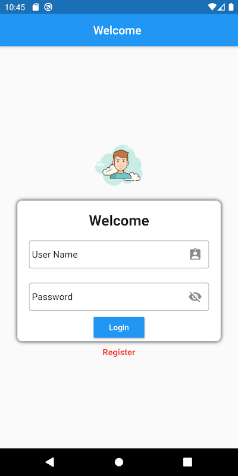
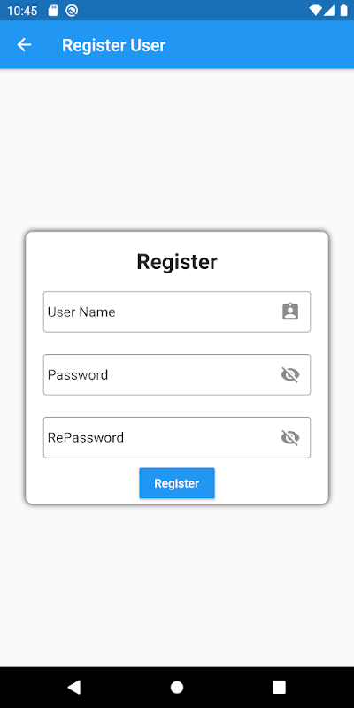
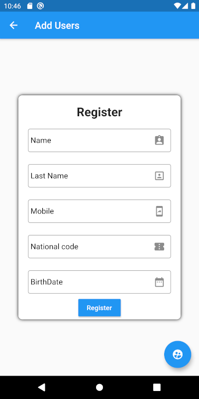
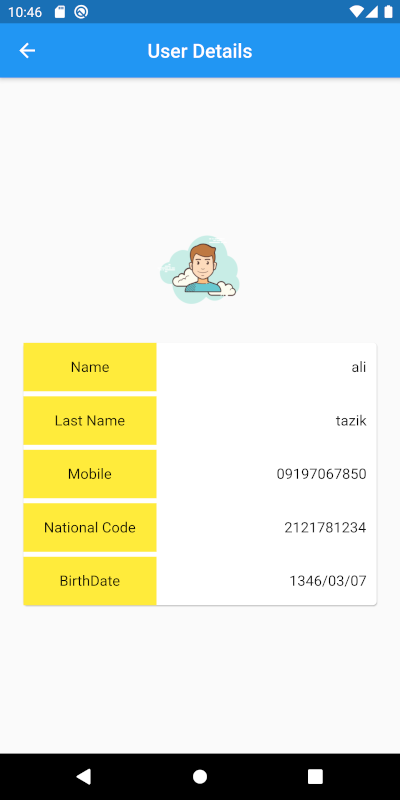

# user_register_app

A new Flutter project.

## Getting Started
 In This project you can register a user and then login to application by registered user.

 User an add users into local database and see a list of users.
  
 user can touch on national code in list item and see all user detailes.
 
 
 
 
 
 
 
 
  
 
  
  
## In this project you can find this tips:
.UI

.sqflite

.SnackBar

.ListView

